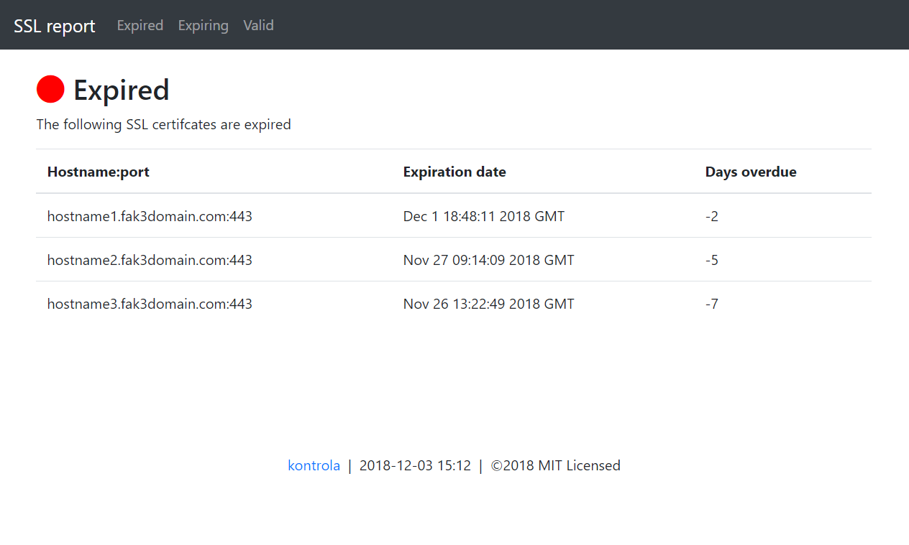

# kontrola

A script that uses nmap to sweep a subnet looking for ports with SSL certs, then querying those certs to discover upcoming expiration dates.

## Motivation

There are plenty of scripts out there that will check SSL/TLS certificates and let you know when they're due for renewal, but none (that I've found) that can sweep a subnet, the check those live hosts for specific hosts to see if they host any certifcates. These "rogue" certs can become a problem, so here we are, trying to solve something with a script.

## Features

* uses `nmap` to discover live hosts on a subnet
* pokes at live hosts, checking known TLS/SSL ports to see if they are available
* query found certificates for experation dates
* html output report using Bootstrap 4
* also provides an easy to parse csv output file

## Usage

* Checkout the code
```
git clone https://github.com/philcryer/kontrola.git
cd kontrola
```

* Edit varables if desired
* Run script

```
./kontrola
```

## Screenshot

The html report

<div align="center"></div>

## License

MIT License

Copyright (c) 2018 Phil Cryer

Permission is hereby granted, free of charge, to any person obtaining a copy
of this software and associated documentation files (the "Software"), to deal
in the Software without restriction, including without limitation the rights
to use, copy, modify, merge, publish, distribute, sublicense, and/or sell
copies of the Software, and to permit persons to whom the Software is
furnished to do so, subject to the following conditions:

The above copyright notice and this permission notice shall be included in all
copies or substantial portions of the Software.

THE SOFTWARE IS PROVIDED "AS IS", WITHOUT WARRANTY OF ANY KIND, EXPRESS OR
IMPLIED, INCLUDING BUT NOT LIMITED TO THE WARRANTIES OF MERCHANTABILITY,
FITNESS FOR A PARTICULAR PURPOSE AND NONINFRINGEMENT. IN NO EVENT SHALL THE
AUTHORS OR COPYRIGHT HOLDERS BE LIABLE FOR ANY CLAIM, DAMAGES OR OTHER
LIABILITY, WHETHER IN AN ACTION OF CONTRACT, TORT OR OTHERWISE, ARISING FROM,
OUT OF OR IN CONNECTION WITH THE SOFTWARE OR THE USE OR OTHER DEALINGS IN THE
SOFTWARE.

### Thanks
